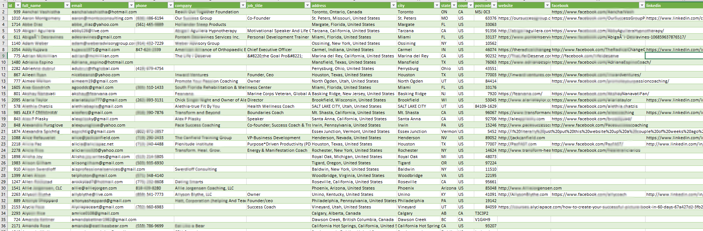
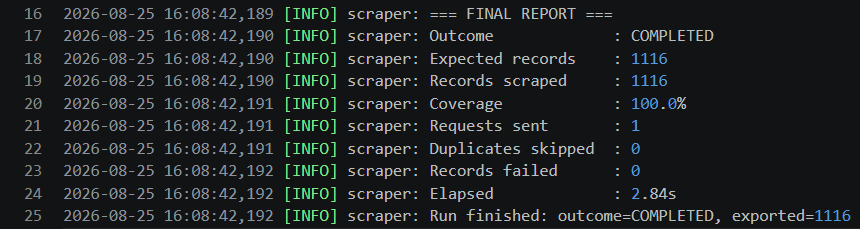

# Directory Contact Extraction — API Reverse Engineering (Practice Project)

**Python • Requests • REST API Reverse Engineering**

A self-initiated project built from a real Upwork job posting, to demonstrate 
my approach to scraping jobs before applying: investigate the target site 
first, find the fastest reliable extraction method, and have working proof 
in hand rather than just a pitch.


---

## Context

I came across an Upwork job asking for ~1,100 US/Canada contacts to be 
extracted from a public business directory site. Rather than applying blind, 
I spent about 20 minutes investigating the site's structure, built a working 
extraction, and confirmed real numbers before writing a proposal.

I did not end up being selected for that specific job — this repo documents 
the technical approach I used to validate the project was feasible and 
quick to deliver.

---

## What I found

The site's search feature was backed by a public JSON REST endpoint that 
returned the entire directory dataset in a single response — no pagination, 
no authentication required. Rather than parsing rendered HTML page-by-page, 
I queried this endpoint directly with standard HTTP requests and browser-like 
headers.

| Metric                   | Value      |
|--------------------------|------------|
| Total directory records  | 1,757      |
| Matched US/CA filter     | 1,116      |
| Records with valid email | 100%       |
| HTTP requests needed     | 1          |
| Total runtime            | ~3 seconds |

The filtered count (1,116) landed within a single record of the client's own 
estimate (~1,115) — strong confirmation the right dataset and filter logic 
were used.

---

## Architecture
main.py
│
▼
Container (dependency wiring)
│
▼
ScraperEngine (fetch -> dedup -> export, batched)
│
├── FetchService — single-call fetch + country filter
│ ├── GenericApiClient — requests.Session + retry + circuit breaker
│ ├── ItemParser — maps raw records to Item objects
│ └── FailedItemStore — records parse/validation failures
├── DeduplicationService — dedup by stable id
├── ExportService — fans out to each exporter
│ ├── CsvExporter
│ └── JsonExporter
└── RunMonitor — final coverage/timing report


Built on a reusable scraper skeleton with abstract interfaces 
(`BaseApiClient`, `BaseHitParser`, etc.) so the HTTP client, parser, and 
exporters can each be swapped independently per project.

---

## Sample output shape

*(fabricated example — not real directory data)*

```json
{
  "id": "10234",
  "full_name": "Jane Doe",
  "email": "jane.doe@example.com",
  "phone": "(555) 123-4567",
  "company": "Doe Consulting",
  "job_title": "Executive Coach",
  "addres": "1010 W 9th St, Austin, TX 78703",
  "city": "Austin",
  "state": "TX",
  "country": "US",
  "postcode":"SW1A 2AA",
  "website":"https://www.jane_...doe.com",
  "facebook":"https://www.facebook.com/jane...doe/",
  "linkedin":"https://www.linkedin.com/company/jane_doe_group"

}
```
---

## Why reverse-engineer instead of parsing HTML

|                 | HTML scraping               | API reverse engineering |
|-----------------|-----------------------------|-------------------------|
| Requests needed | Many (one per page/profile) | 1                       |
| Stability       | Breaks on site redesigns    | Stable JSON contract    |
| Speed           | Minutes                     | Seconds                 |
| Data quality    | Depends on rendered DOM     | Full structured fields |

---

## Engineering highlights

- Dependency injection via a single composition-root `Container`
- Layered architecture with abstract interfaces, swappable per project
- Per-request retry with exponential backoff + circuit breaker for sustained failures
- Deduplication by stable record id
- Pluggable CSV/JSON exporters
- Failed-record capture for parse/validation errors

---

## Requirements
- requests>=2.31
- urllib3>=2.0

### Output 


### Final report from log file


## Disclaimer

Built for educational and portfolio purposes to demonstrate a real-world 
scraping workflow. The target site's identity is intentionally omitted, 
and no real personal data is included in this repository. Anyone running 
scrapers against a live site is responsible for reviewing that site's 
terms of service and applicable law first.

## Author
Sara Mekshaj
Python Developer | Web Scraping / API Reverse Engineering